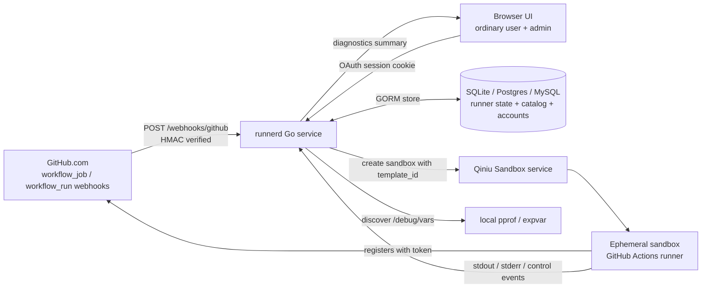
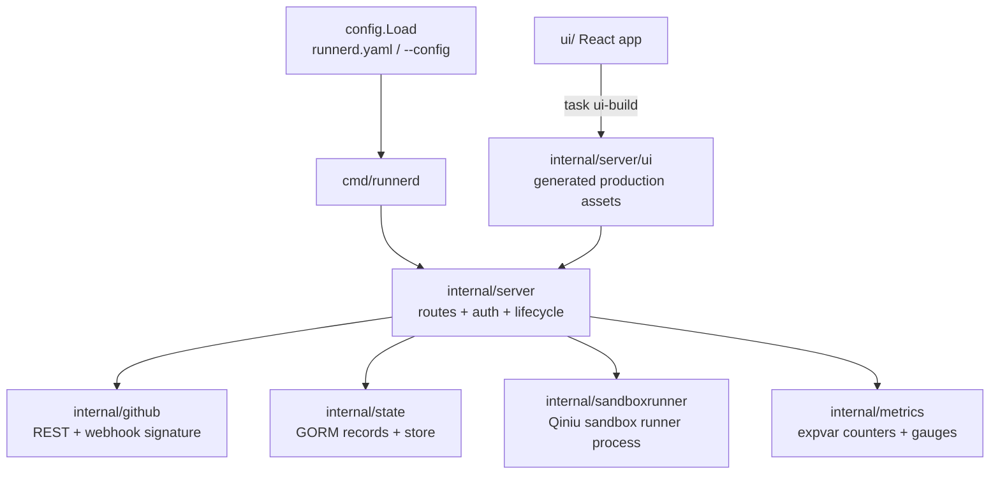
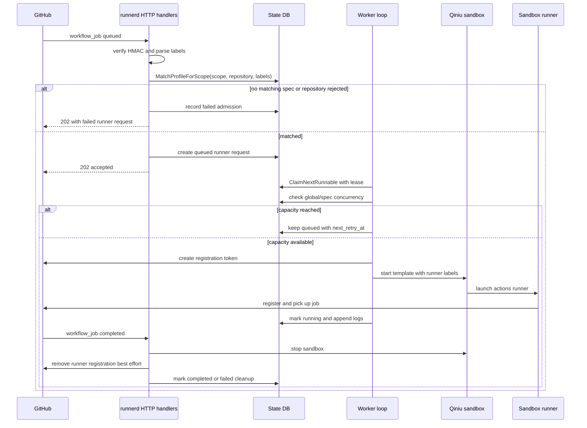
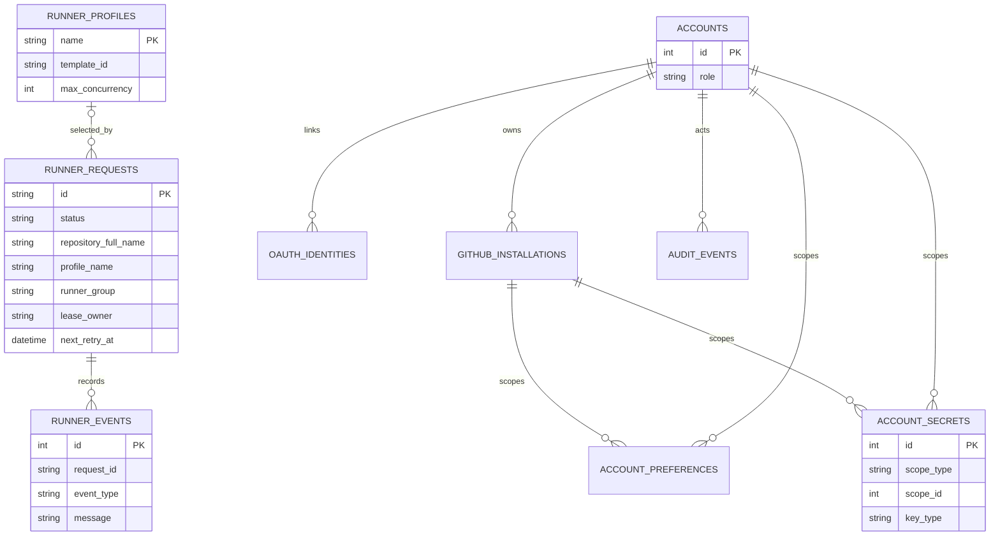
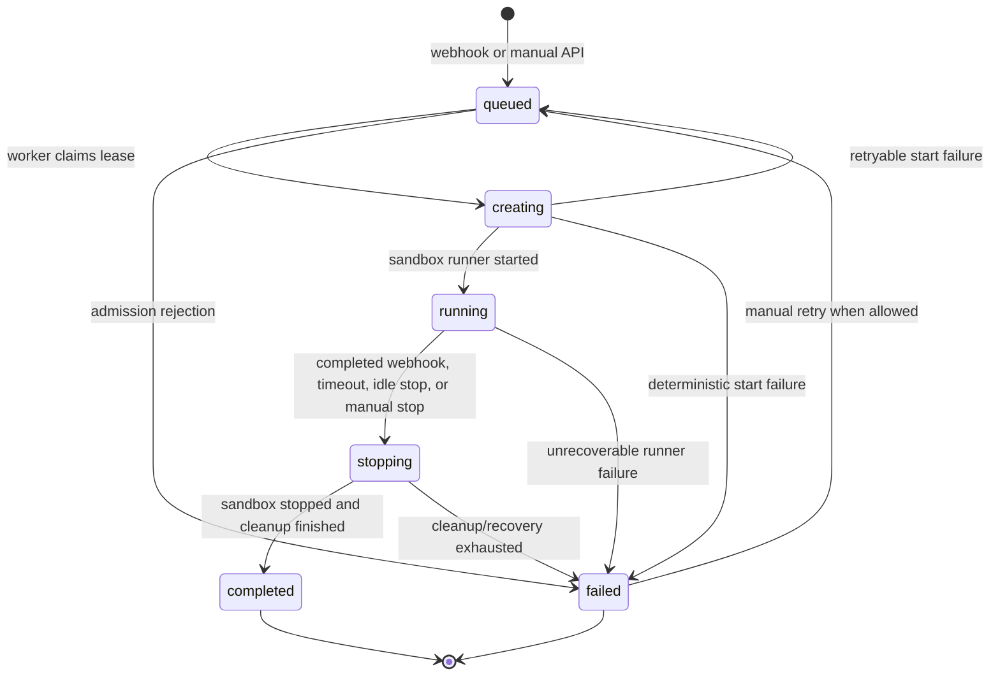
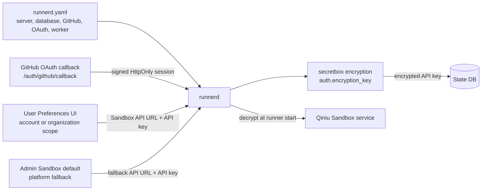

# Runner Architecture Comparison

[Chinese](zh/runner-architecture-comparison.md)

This note records the design comparison that shaped runnerd. It should be read as historical context plus current baseline, not as an implementation plan.

## Current Baseline

runnerd is a single Go service that receives GitHub `workflow_job` webhooks, admits matching jobs by repository and labels, creates Qiniu sandboxes, registers ephemeral GitHub Actions self-hosted runners, and cleans them up after completion or stop.

Implemented pieces:

- File-first runtime config loaded from `runnerd.yaml` by default, or from `--config`.
- SQLite, Postgres, and MySQL state backends through `database.backend` and `database.dsn`.
- DB-backed runner requests, runner events/logs, Runner Specs, local accounts, linked OAuth identities, GitHub installations, account preferences/secrets, and audit events. Internal Runner Group/Policy models have been removed and are not part of the active model.
- Account and GitHub installation scoped Preferences for Sandbox service settings, with API keys stored as encrypted account secrets.
- An admin-managed, disabled-by-default Sandbox service fallback stored independently from account preferences.
- Schema creation is driven by GORM tags in the state record structs, with a narrow legacy compatibility pass followed by `AutoMigrate`; GORM foreign-key creation is intentionally disabled.
- Fixed runner states: `queued`, `creating`, `running`, `stopping`, `completed`, and `failed`.
- DB claim/lease processing with retry metadata (`retry_count`, `next_retry_at`, `lease_owner`, `lease_expires_at`).
- GitHub App auth with optional dynamic installation resolution, plus token and basic auth compatibility modes.
- GitHub App OAuth sign-in for ordinary users and administrators, with local roles and signed HttpOnly sessions.
- Ordinary-user UI for PR/job views, a unified repository access and effective Sandbox service readiness page, account or organization scoped Sandbox service settings, and scoped Sandbox template and runner-instance catalogs.
- Admin API and UI for the account list and audited role controls, runner requests, Runner Specs, the global Sandbox service fallback, retry/stop actions, match tests, audit history, and diagnostics.
- Production UI assets built from `ui/` into `internal/server/ui/`; development assets are proxied to Vite.
- Diagnostics through `github.com/jimmicro/pprof`, `/diagnostics/pprof`, `/diagnostics/vars`, and expvar metrics.

Known boundaries:

- GitHub Enterprise Server is rejected by config validation; only `https://api.github.com` is supported.
- Runner Specs are managed through the admin API/UI, not through `runnerd.yaml`. Internal Runner Groups and Repository Policies are retired; the optional `runner_group` field remains only as the GitHub Organization Runner Group registration target.
- Token and basic auth still exist as compatibility modes. Product policy has not decided whether to keep them for production.
- Multi-instance behavior should not be advertised until two runnerd processes have been verified against the same database.
- Sandbox provider catalogs are ordinary-user resources, not admin configuration. `GET /user/sandbox/templates` and `GET /user/sandbox/instances` resolve scoped credentials and then the enabled admin fallback, accept only supported region ids, and keep secrets server-side.
- Account administration is role-only: accounts and identity links remain OAuth/bootstrap-created. Self-role changes and changes that could leave no administrator are rejected.

## Architecture Overview

runnerd keeps the control plane in one Go process and stores durable state in the configured database. GitHub webhooks and the manual admin API create runner requests; background loops claim queued work, start Qiniu sandboxes, and reconcile or clean up runners after GitHub job events.

### Runtime Modules

The server package wires HTTP routes, GitHub clients, the state store, the sandbox service, and background loops. UI assets come from `ui/` and are either embedded production files or proxied to Vite in development.

### Runner Request Lifecycle

Admission and capacity are separate steps. Webhooks admit a request only after the repository allowlist and the effective account/Organization Runner Spec label checks pass. Exact scoped custom labels are evaluated before the scope-controlled global catalog, and the selected source, scope, and name are persisted with the request. Capacity is checked later by the worker when it claims a queued request, so over-capacity work remains queued instead of being rejected. Before registration or Sandbox creation, the worker reloads that persisted identity and revalidates the latest enabled state and requested labels.

### State Model

The configured database is the durable source for runner requests and control-plane objects. Logs are stored as runner events, and account or GitHub-installation scoped Sandbox API keys are encrypted before they enter the store.

### Request State Machine

The status values are intentionally small. Retryable failures move a request back to `queued` with retry metadata, while deterministic admission or configuration failures end at `failed`.

### Configuration And Secret Boundaries

`runnerd.yaml` configures service behavior, GitHub auth, OAuth login, database, and worker policy. Sandbox service credentials are not file config: ordinary users configure scoped credentials through Preferences, while admins may enable an independent platform fallback at `/admin/sandbox_service`. API keys are stored encrypted. The fallback audience is all repository owners or selected GitHub users/organizations matched by stable owner identity. Resolution order is request snapshot, installation custom/inherited config, eligible personal account config, enabled and audience-eligible admin default, then not configured.

## Comparison

| Dimension | runnerd now | Fireactions | Actions Runner Controller |
| --- | --- | --- | --- |
| Deployment | Single Go service | Runner orchestration service | Kubernetes operator |
| Compute | Qiniu sandbox | Firecracker microVM | Kubernetes pod |
| State source | SQLite/Postgres/MySQL DB | Service-managed pool state | Kubernetes API / CRD status |
| Scheduling input | GitHub webhooks + admin API | Pool desired/current state | Scale set/listener reconciliation |
| Runner selection | Enabled Runner Specs and label matching | Pool/profile selection | Runner groups and scale sets |
| Auth | GitHub App, token, or basic auth | GitHub App | GitHub App / scale set auth |
| Diagnostics | Admin diagnostics + pprof/expvar | Pool metrics | Controller/workflow metrics |
| Operational scope | Lightweight service for Qiniu sandbox runners | Dedicated VM runner platform | Full Kubernetes-native controller |

runnerd intentionally keeps the Qiniu sandbox execution model and avoids the Kubernetes control-plane complexity of ARC. The useful ideas carried over are the reconciliation mindset, repository visibility rules, profile/spec-based runner selection, and workflow job metrics.

## Scheduling Model

Admission uses the GitHub webhook payload repository and labels. A runner request is admitted only when:

- the webhook HMAC signature is valid;
- `github.allowed_repositories` permits the repository, if configured;
- an enabled Runner Spec satisfies `required_labels ⊆ job_labels ⊆ labels`;
- the matched spec is enabled.

After the repository allowlist check, a resolved account or Organization scope first checks an exact scoped custom label set. A disabled exact custom match explicitly shadows the global catalog with `profile_scope_disabled`; if no exact custom match exists, matching falls back to the unchanged global catalog. If no scope can be resolved, the same global catalog remains the compatibility path. Internal Runner Groups and Repository Policies no longer exist or participate in matching. When a spec includes a GitHub runner group, runnerd creates an organization runner for the job repository owner and passes that group as `--runnergroup`.

Capacity is checked later when the worker starts a queued request. Global specs enforce their global limit; scoped custom specs enforce their own scope limit, and all requests remain subject to `worker.max_concurrent_runners`. Requests above a limit remain `queued` and are retried later. A queued request whose persisted spec is now disabled or no longer satisfies its requested labels fails at `profile_validation` instead of launching from stale admission state. Transient placement/rate-limit signals are treated as queue deferrals instead of hard failures.

## State And Recovery

Runner state is database-backed. The worker claims runnable requests with lease metadata, moves them through the state machine, and releases or retries work based on outcome. The sweeper/reconciler loops handle:

- stale `creating` requests;
- timed-out `stopping` cleanup;
- active runners that need recovery after restart;
- mismatches between original workflow jobs and assigned GitHub jobs.

The design deliberately uses portable DB semantics rather than relying on Postgres-only locking features for the core path. SQLite remains valid for local and small single-node deployments; Postgres and MySQL are available for more durable deployments, pending multi-process validation.

The schema source of truth lives in `internal/state/records.go`. Startup migration runs a narrow legacy compatibility pass in `internal/state/db.go` before GORM `AutoMigrate`. This keeps fresh database creation model-driven while preserving known older sqlite upgrade paths for missing columns and obsolete OAuth constraints. Incompatible legacy account preference/secret tables without scope columns are intentionally dropped and recreated; their rows are not migrated. Operators must reconfigure affected Sandbox settings/API keys, and affected users must reauthenticate with GitHub before installation sync.

## Request Loading And Observability

The React application uses the pure policies in `ui/src/app-load-policy.ts` to load only the resources required by the active route. Jobs and dynamic Admin request surfaces may poll; static or unrelated account and catalog surfaces do not inherit a global polling loop. Mutation refreshes stay scoped to the active surface.

Runner-request lists use bounded pagination and list-only database projections instead of loading raw webhook, label, or encrypted Sandbox fields. Ordinary-user lists apply the exact `(github_installation_id, repository_full_name)` authorization intersection before database limits and merge bounded installation results into one globally ordered page.

Successful repository authorization is cached for at most 30 seconds. A request after 20 seconds may return the still-valid entry while one background refresh runs; expired, missing, or rejected credentials fail closed, and transient errors never extend the original expiry. HTTP timing counters use mux route patterns rather than concrete IDs so expvar metric cardinality remains bounded.

## Diagnostics

The service imports `github.com/jimmicro/pprof`, which starts a local-only pprof/expvar service and writes discovery files near the binary. The admin runtime diagnostics surface exposes:

- discovered pprof address files and dump scripts;
- DB backend/path, with secrets redacted;
- GitHub auth mode and installation details;
- retry, lease, runner lifecycle, GitHub API, and workflow metrics from the current process's expvar registry.

Per-request state, findings, GitHub Job correlation, and lifecycle/output events belong to the canonical `/admin/runner_requests/{id}` resource page rather than the runtime diagnostics payload.

The admin UI should display diagnostics summaries, not expose raw pprof directly to the public internet.

## Remaining Design Decisions

- Decide whether GitHub token and basic auth remain supported compatibility modes or should be removed for production.
- Keep `/repositories` as the canonical readiness surface: show the user/GitHub App authorized repository intersection, annotate local job activity, and link a missing manageable Sandbox source to its scoped Preferences editor.
- Add an effective-config or config-validation workflow only if operators need UI-based runtime config inspection.
- Verify shared-database lease behavior with two runnerd processes before documenting multi-instance support.
- Decide whether expvar is enough or whether a Prometheus/export adapter is needed.
